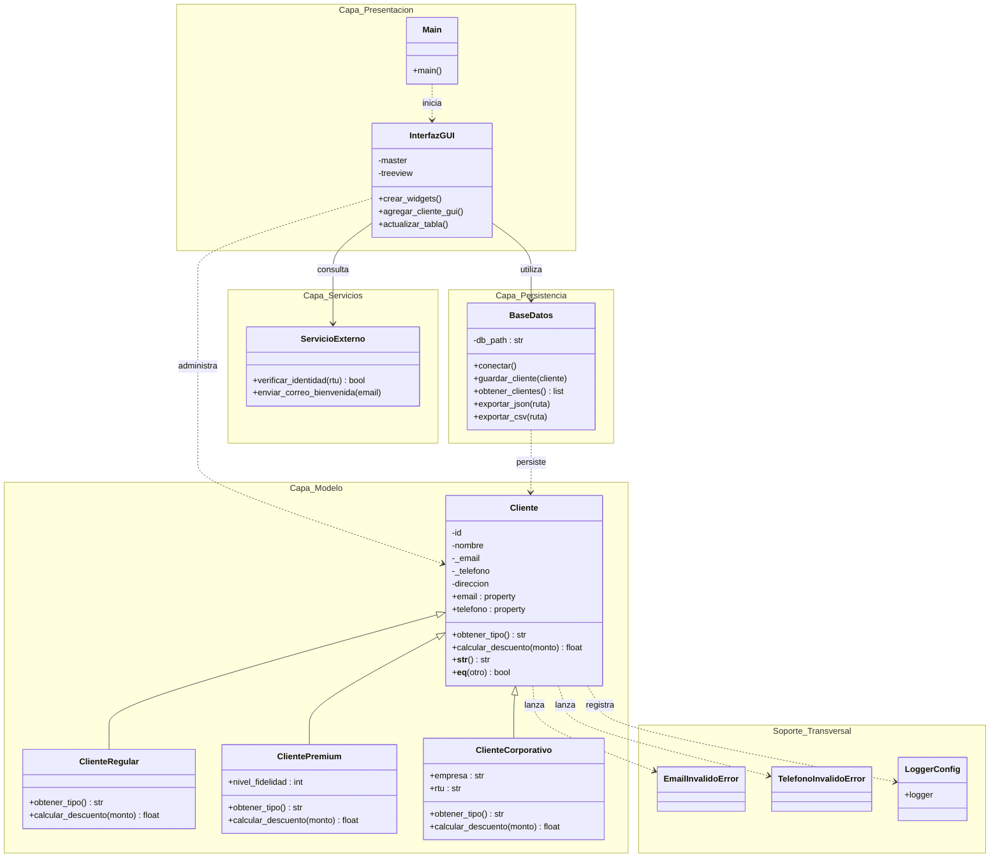

# Solution Tech — Gestor Inteligente de Clientes

Sistema de gestión de clientes desarrollado en Python 3 bajo un esquema modular por capas. La solución aplica los principios avanzados de Programación Orientada a Objetos (POO), persistencia de datos relacional, servicios externos y una interfaz gráfica de usuario (GUI) con Tkinter.

---

## Aspectos Técnicos y Arquitectura

El proyecto sigue una arquitectura por capas para garantizar el desacoplamiento y facilitar el mantenimiento:

<u>1. Capa de Modelo (`cliente.py`)</u>: Define la jerarquía de clases utilizando POO. Aplica herencia y polimorfismo mediante una clase base `Cliente` y subclases especificas (`ClienteRegular`, `ClientePremium`, `ClienteCorporativo`).
<u>2. Capa de Persistencia (`base_datos.py`)</u>: Encargada de gestionar la base de datos SQLite (`app_data.db`), sincronizar datos en JSON y exportar reportes en CSV.
<u>3. Capa de Servicios (`servicios.py`)</u>: Simula servicios externos de verificación de identidad mediante API REST e integración de correo electrónico.
<u>4. Capa de Interfaz Gráfica (`gui.py`)</u>: Desarrollada con Tkinter y `ttk`, proporcionando un formulario intuitivo, tabla dinámica de visualización de datos y manejo de eventos.
<u>5. Manejo de Excepciones y Logs (`excepciones.py`, `logger_config.py`)</u>: Excepciones personalizadas para el control de errores de dominio y registro centralizado de eventos del sistema.

---

## Diagrama de Clases UML


## Capturas de Pantalla y Demostración

### Interfaz Gráfica (GUI)


### Ejecución por Consola


### Organización de archivos del proyecto


---
```
## Repo Git
https://github.com/catacode-tech/gestor_clientes

