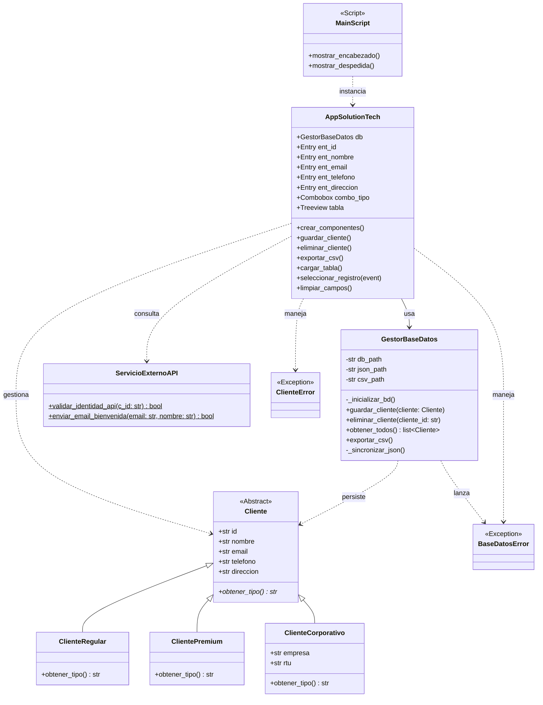
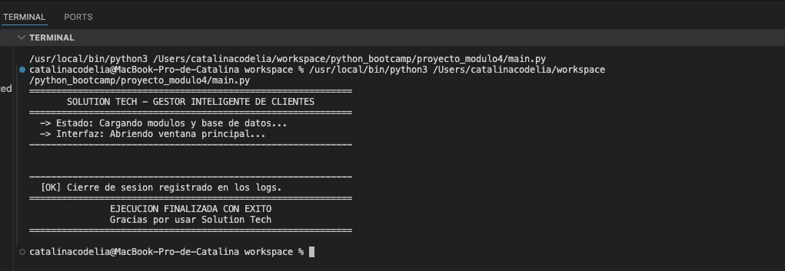
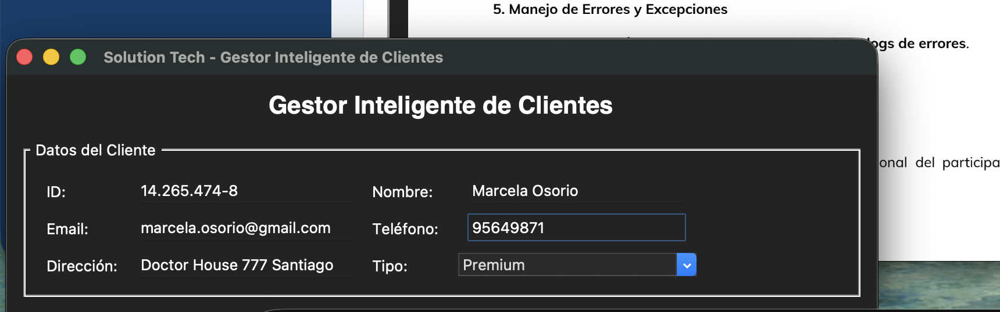
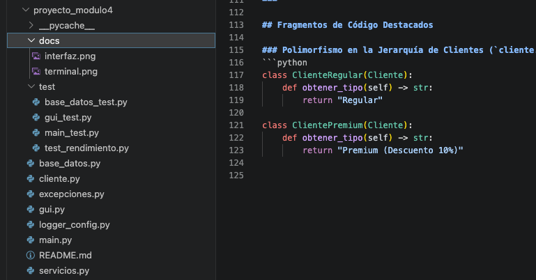

# Solution Tech — Gestor Inteligente de Clientes

Sistema de gestión de clientes desarrollado en Python aplicando Programación Orientada a Objetos (POO), persistencia de datos relacional y no relacional, integración con APIs y una interfaz gráfica de usuario (GUI) con Tkinter.

---

## Aspectos Técnicos y Arquitectura

El proyecto sigue una arquitectura por capas para garantizar el desacoplamiento y facilitar el mantenimiento:

1. **Capa de Modelo (`cliente.py`)**: Define la jerarquía de clases utilizando POO. Aplica herencia y polimorfismo mediante una clase base `Cliente` y subclases especificas (`ClienteRegular`, `ClientePremium`, `ClienteCorporativo`).
2. **Capa de Persistencia (`base_datos.py`)**: Encargada de gestionar la base de datos SQLite (`app_data.db`), sincronizar datos en JSON y exportar reportes en CSV.
3. **Capa de Servicios (`servicios.py`)**: Simula servicios externos de verificación de identidad mediante API REST e integración de correo electrónico.
4. **Capa de Interfaz Gráfica (`gui.py`)**: Desarrollada con Tkinter y `ttk`, proporcionando un formulario intuitivo, tabla dinámica de visualización de datos y manejo de eventos.
5. **Manejo de Excepciones y Logs (`excepciones.py`, `logger_config.py`)**: Excepciones personalizadas para el control de errores de dominio y registro centralizado de eventos del sistema.

---

## Diagrama de Clases UML


## Capturas de Pantalla y Demostración

### Interfaz Gráfica (GUI)


### Ejecución por Consola


### Organización de archivos del proyecto


---

## Fragmentos de Código Destacados

### Polimorfismo en la Jerarquía de Clientes (`cliente.py`)
```python
class ClienteRegular(Cliente):
    def obtener_tipo(self) -> str:
        return "Regular"

class ClientePremium(Cliente):
    def obtener_tipo(self) -> str:
        return "Premium (Descuento 10%)"
```
## Repo Git
https://github.com/catacode-tech/gestor_clientes

